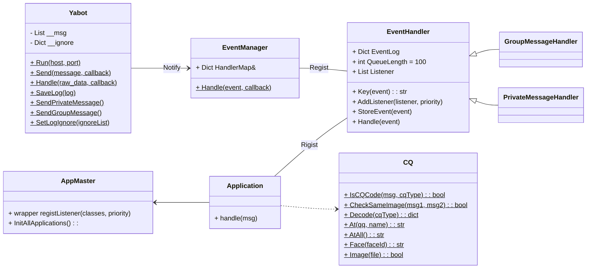

# Yabot 开发文档
v 0.1beta
## 概述
`Yabot` 基于 `WebSocket` 与 `GO-CQHTTP` 进行通讯
### TODO
- [ ] 基础：表情支持
- [ ] 基础：异常处理
- [ ] 高级：Applicaiton 热更新
- [ ] 应用：吃什么 [需求](Requirements.md#吃什么)
- [ ] 应用：搜图功能 [需求](Requirements.md#搜图功能)
- [ ] 应用：生日祝福 [需求](Requirements.md#生日祝福)
## Yabot 框架结构

### Yabot
`Yabot` 基本上是框架的入口，它包含如下功能:
* 实现了 `ws` 的接口，可以接收和发送 `ws` 事件，以与 `GO-CQHTTP` 通讯。
* 为下层提供了发送消息的接口，该接口可以给出一个回调，用于处理返回的消息。例如：通过 `GO-CQHTTP` 查询在线状态，回调则根据返回的结果进行处理，若为隐身，则改为在线。
* 打印、存储消息记录，可在 `main.py` 中设置忽略的消息类型，默认忽略**元事件**类型。
> ❌ 通常不应修改  
> ✔ 可追加给下层的接口

### EventManager
`EventManager` 负责确定收到的事件类型，并在 `HandlerMap` 查找对应的 `EventHandler` 来处理。
> ❌ 通常不应修改  
> ✔ 在 `main.py` 中修改 `HandlerMap`，即各个事件对应的 `EventHandler`

### EventHandler
`EventHandler` 是所有事件处理器的父类，他包含如下功能：
* 处理事件
* 追加 `Listener`：在该事件下注册一个新的 `Listener`，所有注册的 `Listener` 会根据他们的优先级 `Priority` 排序，优先级高的 `Listener` 会先一步接收到事件信息，并能阻止后续 `Listener` 接收该信息；
* 缓存过往事件，通过 `Key(event)` 从事件中提取 `key` 以分门别类缓存事件；
> ❌ 通常不应修改  
> ✔ 可追加新的 EventHandler 子类  
> ✔ 实现子类时**可能**需要修改的方法：
> * `Key (msg)`：这个方法用于提取区分 `Event` 的 `Key`，用于缓存过往的 `Event` 以便后续查找。例如，对于群消息事件，可用群号做 `Key`，来以群号为区分缓存过往的群消息记录，后续可追溯某个群的消息记录。
> * `Handle (msg)`：可以在原有 `Handle` 的基础上添加需要的功能，但一般来讲需要调用 `super().Handle(event)` 确保基本功能没有问题

## 新增应用
应用的模板代码如下：
``` python
from Yabot import Yabot

#from YaBotCore.CQ import CQ
from YaBotCore.Handlers.MessageHandler import *

from Applications.AppMaster import registListener

class App_Name:
    Priority = 2500

    @ registListener([GroupMessageHandler], Priority)
    def handler(msg):
        # TODO: write your code here
        return False
```
注意：
* 新应用应保存在 `Applications` 文件夹内，否则不会被载入；
* 类名应为 `App_NewAppName` 的形式，以确保不会和 `Yabot` 框架的类重名；
* `@ registListener([GroupMessageHandler], Priority)` 是一个装饰器，当导入该模块时，会自动使装饰的方法注册到指定的 `EventHandler` 下
  * 第一个参数是要注册的 `EventHandler` 的**列表**，注意，是列表，即一个处理函数可能同时关注多种事件。
  * 第二个参数是优先级，你可以直接使用该应用指定的，如果有多个 handler，也可以分别指定不同的优先级。
* 返回值应为 `bool`，意为 “Should Block Later Listener？”，但代码中并没有给名字。当返回 `True` 时，`EventHandler` 便不会再遍历后续优先级低于（或部分等于）此应用的 `Listener`
